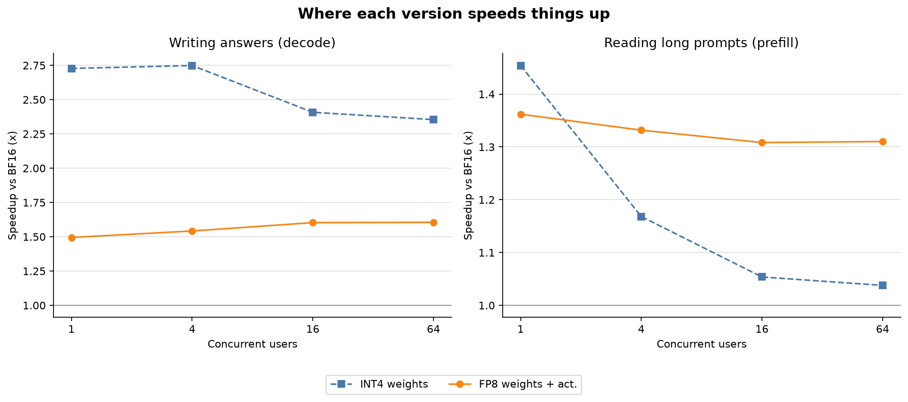
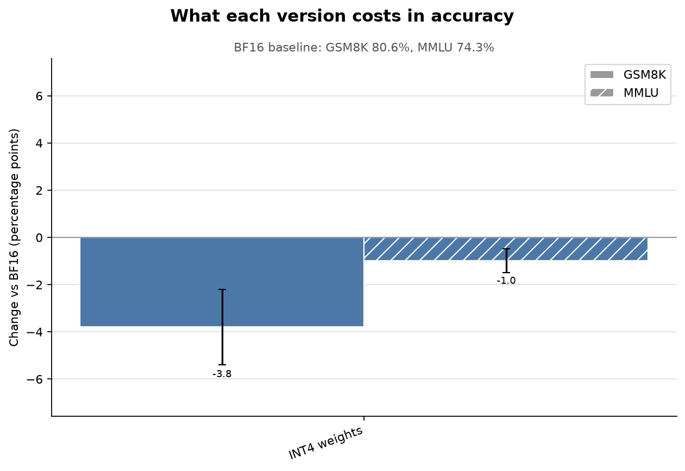
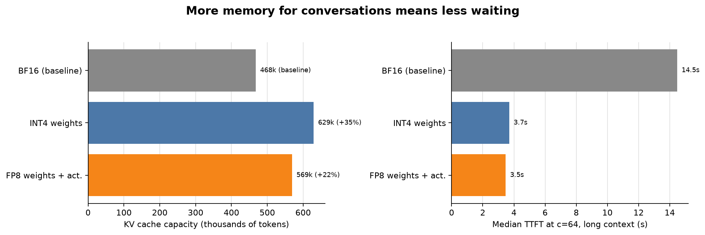
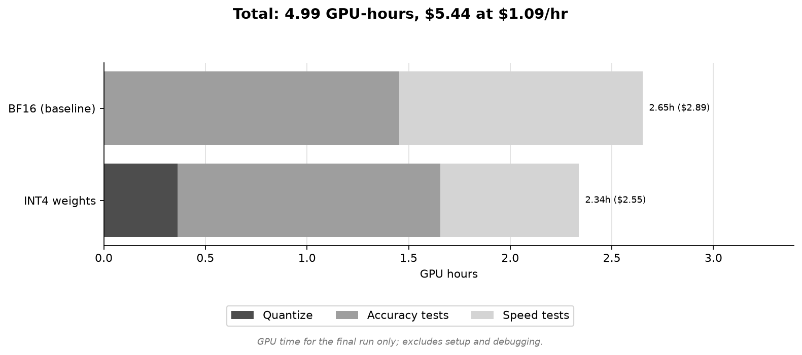

# Quantization Bench: which part of an LLM should you quantize?

Controlled benchmark of what weight, activation, and KV-cache quantization each buy you on Qwen2.5-7B-Instruct, served with vLLM on one NVIDIA L40S (48 GB). Eight configs were run end to end (quantize, full-set accuracy evals, and a 3-workload serving sweep). Weight-only quantization gave the largest single-stream decode gains (INT4: 2.73x at concurrency 1) and no prefill gain at INT8/FP8. Weight+activation quantization (FP8, INT8) gave the prefill gains (1.31x and 1.38x at concurrency 64) at about 0.5 pp MMLU and 0.5 to 0.6 pp GSM8K cost. KV-cache FP8 doubled KV capacity as designed, but both FP8 KV configs produce broken outputs in this setup (GSM8K 0.00%, MMLU near chance); root cause is unknown, so their speed and capacity numbers are reported but are not deployable results. Two of the ten planned configs (attention-projection-only) were skipped for budget.

Writeup: https://x.com/amnryx/status/2104963112893841914

All numbers below come from files in this repo (`results/article/summary.md`, `results/target/*/{eval,meta,bench_meta}.json`, `results/target/*/bench_*.json`, `configs/`, `requirements-lock.txt`, `ANALYSIS.md`).

---

## 1. Question and hypotheses

Inference has two regimes: prefill (compute-bound, whole prompt at once) and decode (memory-bandwidth-bound, weights re-read every step). Each quantization target is hypothesized to act on a different one:

| Quantize | Hypothesis | Workload built to stress it |
|---|---|---|
| Weights | Speeds up decode (less weight traffic per step) | `decode`: 128 in / 512 out |
| Activations | Speeds up prefill (low-precision compute, needs quantized weights too) | `prefill`: 4096 in / 16 out |
| KV cache | Increases KV capacity, which helps concurrency at long context | `longctx`: 8192 in / 256 out |

Each hypothesis is tested with a subtraction that isolates one effect (section 5) and paired with accuracy cost on GSM8K and MMLU.

---

## 2. Setup

| Item | Value | Source |
|---|---|---|
| Target model | `Qwen/Qwen2.5-7B-Instruct` | `configs/models/target.yaml` |
| Smoke model | `Qwen/Qwen2.5-0.5B-Instruct` | `configs/models/qwen2.5-0.5b.yaml` |
| Target GPU | 1x NVIDIA L40S 48 GB (`GPU 0 has a total capacity of 44.39 GiB` in the run log) | `configs/profiles/full.yaml`, `scripts/article_plots.py`, `results/target/run_full.log.gz` |
| Smoke GPU | L4 24 GB | `configs/profiles/smoke.yaml` (comment) |
| Local dev | Mac M2, script logic only (`local` profile, HF backend, dry-run bench) | `configs/profiles/local.yaml` |
| `max_model_len` | 20480 | `configs/models/target.yaml` |

Library versions (`requirements-lock.txt`):

| Package | Version |
|---|---|
| vllm | 0.19.0 |
| llmcompressor | 0.10.0.3 |
| compressed-tensors | 0.14.0.1 |
| lm_eval | 0.4.13 |
| torch | 2.10.0 |
| transformers | 4.57.6 |
| flashinfer-python | 0.6.6 |
| flashinfer-cubin | 0.6.6 |

The 0.5B smoke run used the unpinned `requirements-pod.txt` (`setup_pod.sh` without `--locked`), so its exact versions are not recorded in the repo.

---

## 3. Config matrix

Tier definition (`configs/matrix.yaml`): `tier_axis: bits` means tier is the bit-width (weights, attn-proj; tier 1 = 8-bit, tier 2 = 4-bit). `tier_axis: format` means both tiers are 8-bit and tier 2 is the harder/lossier format at equal bit-width (activations, KV).

Calibration for every non-control config: `HuggingFaceH4/ultrachat_200k`, split `train_sft`, 512 samples, `max_seq_len` 2048, shuffled with seed 42, chat template applied (`configs/models/target.yaml`, `scripts/quantize.py`). Quantization uses llm-compressor `oneshot`. Weight configs ignore `lm_head`.

| id | target | tier | tier_axis | Scheme (from `configs/quant/*.yaml`) | Notes |
|---|---|---|---|---|---|
| `bf16` | control | 0 | none | No quantization | Baseline |
| `w8a16` | weights | 1 | bits | INT8 weights (`W8A16`), GPTQ, `group_size: 128` in yaml, targets `Linear` | Ran |
| `w4a16` | weights | 2 | bits | INT4 weights (`W4A16`), GPTQ, `group_size: 128` in yaml, targets `Linear` | Ran |
| `w8a16-fp8` | isolation-ref | none | none | FP8 weights, no activation quant, no GPTQ (`algorithm: none`), per-channel weights | Isolation reference only (`is_isolation_ref: true`) |
| `w8a8-fp8` | activations | 1 | format | FP8 weights + `FP8_DYNAMIC` activations (dynamic, per-token), `algorithm: none` | Ran |
| `w8a8-int8` | activations | 2 | format | SmoothQuant (`smoothing_strength: 0.8`) + GPTQ `W8A8`; activations dynamic per-token; `group_size: 128` listed in yaml | Ran |
| `kv-fp8-e4m3` | kv | 1 | format | BF16 weights/activations; 8-bit float KV cache, tensor strategy, static scales from calibration; vLLM `--kv-cache-dtype fp8_e4m3` | Ran; outputs broken (section 9) |
| `kv-fp8-e5m2` | kv | 2 | format | Same KV recipe in yaml; vLLM `--kv-cache-dtype fp8_e5m2` | Ran; outputs broken (section 9) |
| `attn-proj-w8` | attn-proj | 1 | bits | INT8 weight-only (`W8A16`) GPTQ on `q_proj/k_proj/v_proj/o_proj` only, MLP stays BF16 | Skipped for budget (`SKIPPED` marker) |
| `attn-proj-w4` | attn-proj | 2 | bits | INT4 weight-only (`W4A16`) GPTQ on `q_proj/k_proj/v_proj/o_proj` only, MLP stays BF16 | Skipped for budget (`SKIPPED` marker) |

Implementation notes from `scripts/quantize.py`:
- `group_size` is not passed to llm-compressor. The code comment says the `W4A16`/`W8A16` presets already use group size 128 (checked against compressed-tensors 0.14), so the yaml field is documentation only. Checkpoints are gitignored, so the resulting granularity was not re-inspected for this README.
- The KV `format` field (`e4m3`/`e5m2`) is also not passed to llm-compressor. Both KV configs go through the same calibration recipe (8-bit float, tensor, static); the e4m3/e5m2 difference is applied by the vLLM `--kv-cache-dtype` flag at serve time.
- KV configs floor calibration at 512 samples (a no-op for the 7B model, whose default is already 512).

The article table labels map to config ids as: BF16 = `bf16`; INT4 weights = `w4a16`; INT8 weights = `w8a16`; FP8 weights = `w8a16-fp8`; FP8 weights + act. = `w8a8-fp8`; INT8 weights + act. = `w8a8-int8`; FP8 KV (e4m3) = `kv-fp8-e4m3`; FP8 KV (e5m2) = `kv-fp8-e5m2`.

---

## 4. Eval settings

| Setting | Value | Source |
|---|---|---|
| Harness | lm-eval `simple_evaluate`, `vllm` backend | `scripts/eval.py` |
| Tasks | `gsm8k`, `mmlu` (57 subtasks) | `configs/profiles/full.yaml` |
| Few-shot | 5 | `configs/profiles/full.yaml` |
| Sample limit | none: GSM8K n=1319, MMLU n=14,042 | `full.yaml`, `eval.json` |
| Chat template | not applied (`apply_chat_template` is not passed) | `scripts/eval.py` |
| GSM8K metric | `exact_match`, `strict-match` filter | `scripts/article_plots.py` |
| MMLU metric | `acc,none` of the aggregate `mmlu` group | `scripts/article_plots.py` |
| Eval engine args | `dtype=auto`, `max_model_len=20480`, `gpu_memory_utilization=0.70`, `batch_size=16` | `scripts/eval.py` |
| Error bars | lm-eval reported stderr | `eval.json` |

The eval settings `gpu_memory_utilization=0.70` and `batch_size=16` were set after the first full bf16 eval OOM'd at 0.85 / `auto:8` (commit `9ce3a3d`). They are the same for every config.

Per-config stderr: GSM8K 1.09 to 1.16 pp for the six non-broken configs (BF16: 1.09), MMLU 0.35 to 0.36 pp.

**RULER was never run.** `wonderwords` and `nltk` are not in `requirements-lock.txt`, so every RULER call failed at import inside `run_ruler()`'s try/except. This was recorded as `{"error": ...}` in `eval.json` (`ruler_4096`, `ruler_16384`) and did not fail the config. It failed the same way in the smoke run. RULER is dropped so every config keeps identical eval settings (installing deps mid-run would have made later configs differ from bf16). See `ANALYSIS.md`.

---

## 5. Isolation methodology

Each pair of configs differs in one variable. Subtractions are defined in `configs/matrix.yaml` (`isolation_deltas`):

| Effect | Subtraction | What it isolates |
|---|---|---|
| Weight effect, tier 1 | `w8a16` - `bf16` | INT8 weights, BF16 activations |
| Weight effect, tier 2 | `w4a16` - `bf16` | INT4 weights, BF16 activations |
| Activation effect, tier 1 | `w8a8-fp8` - `w8a16-fp8` | FP8 activations, with FP8 weights held fixed |
| Activation effect, tier 2 | `w8a8-int8` - `w8a16` | INT8 activations, with INT8 weights held fixed |
| KV effect, tier 1 | `kv-fp8-e4m3` - `bf16` | e4m3 KV cache, BF16 everything else |
| KV effect, tier 2 | `kv-fp8-e5m2` - `bf16` | e5m2 KV cache, BF16 everything else |

`w8a16-fp8` exists only to make the tier-1 activation subtraction fair (same FP8 weights on both sides).

**Caveat: the tier-2 activation isolation is imperfect.** `w8a8-int8` applies SmoothQuant (strength 0.8) before GPTQ, which rescales weights and activations, while `w8a16` has no SmoothQuant. The subtraction therefore does not hold the weights identical. This likely explains why `w8a8-int8` scores higher than `w8a16` on GSM8K (79.98% vs 78.32%), a result that would be implausible if activation quantization were the only difference. This explanation is not tested in this repo.

---

## 6. Bench settings

Server (`scripts/serve_bench.py`, `configs/profiles/full.yaml`): `vllm serve <checkpoint> --max-model-len 20480 --gpu-memory-utilization 0.90 --max-num-seqs 256 --no-enable-prefix-caching`, plus the config's `vllm_extra_args` (the `--kv-cache-dtype` flag for KV configs). One server per config, torn down after its sweep.

Client: `vllm bench serve --backend vllm --dataset-name random --num-prompts 200 --max-concurrency <c> --ignore-eos --seed 42`. Request rate is `inf` (`bench_*.json`). Every cell completed 200/200 requests with 0 failures.

| Workload | Input tokens | Output tokens | Concurrency |
|---|---|---|---|
| `decode` | 128 | 512 | 1, 4, 16, 64 |
| `prefill` | 4096 | 16 | 1, 4, 16, 64 |
| `longctx` | 8192 | 256 | 16, 64, 128, 256 |

KV capacity is scraped from the server startup log line `GPU KV cache size: N tokens` and stored as `kv_cache_tokens` in `bench_meta.json`.

Metrics used in the tables: decode throughput = `output_throughput` (output tok/s). Prefill throughput = `total_input_tokens / duration` (input tok/s). Longctx = `median_ttft_ms`. Speedups are the ratio to BF16 at the same concurrency.

---

## 7. Results

### Summary table (`results/article/summary.md`)

| Config | GSM8K | dGSM8K (pp) | MMLU | dMMLU (pp) | KV tokens | KV vs BF16 | Decode c1 (tok/s) | Decode c64 (tok/s) | Decode c1 speedup | Decode c64 speedup | Prefill c64 (tok/s) | Prefill c64 speedup | Longctx c64 TTFT (s) | GPU hours |
|---|---|---|---|---|---|---|---|---|---|---|---|---|---|---|
| BF16 (baseline) | 80.59% | +0.00 | 74.26% | +0.00 | 467,600 | +0% | 49.1 | 1864.0 | 1.00x | 1.00x | 11615.1 | 1.00x | 14.5 | 2.65 |
| INT4 weights | 76.80% | -3.79 | 73.27% | -0.98 | 629,360 | +35% | 133.9 | 4388.6 | 2.73x | 2.35x | 12054.2 | 1.04x | 3.7 | 2.34 |
| FP8 weights + act. | 80.14% | -0.45 | 73.80% | -0.46 | 568,960 | +22% | 73.4 | 2992.7 | 1.50x | 1.61x | 15218.5 | 1.31x | 3.5 | 2.20 |
| FP8 weights | 79.61% | -0.99 | 74.06% | -0.19 | 573,952 | +23% | 85.9 | 3114.8 | 1.75x | 1.67x | 8644.1 | 0.74x | 4.5 | 2.64 |
| FP8 KV (e4m3) (broken output) | 0.00% | -80.59 | 23.79% | -50.46 | 935,200 | +100% | 49.5 | 1892.7 | 1.01x | 1.02x | 11947.6 | 1.03x | 2.0 | 2.60 |
| INT8 weights | 78.32% | -2.27 | 74.18% | -0.07 | 573,952 | +23% | 80.3 | 3075.2 | 1.63x | 1.65x | 9750.5 | 0.84x | 4.2 | 2.81 |
| INT8 weights + act. | 79.98% | -0.61 | 73.76% | -0.49 | 569,072 | +22% | 74.0 | 2965.7 | 1.51x | 1.59x | 16052.5 | 1.38x | 3.5 | 2.36 |
| FP8 KV (e5m2) (broken output) | 0.00% | -80.59 | 24.33% | -49.92 | 935,200 | +100% | 49.5 | 1912.0 | 1.01x | 1.03x | 12092.9 | 1.04x | 1.9 | 2.61 |

**Total: 20.22 GPU-hours, $22.45 at $1.11/hr** (the rate is the default of `scripts/article_plots.py`; billing data is not in the repo).

GPU hours per config = `quantize_seconds` + `eval_seconds` + summed bench `duration` (server startup and model download are not counted).

### Figures (`results/article/`)









### Throughput by concurrency (from `bench_*.json`)

Decode output throughput (tok/s):

| Config | c1 | c4 | c16 | c64 |
|---|---|---|---|---|
| bf16 | 49.1 | 186.1 | 665.4 | 1864.0 |
| w4a16 | 133.9 | 511.5 | 1602.2 | 4388.6 |
| w8a16 | 80.3 | 309.0 | 1144.6 | 3075.2 |
| w8a16-fp8 | 85.9 | 331.0 | 1215.1 | 3114.8 |
| w8a8-fp8 | 73.4 | 287.0 | 1066.7 | 2992.7 |
| w8a8-int8 | 74.0 | 288.0 | 1073.3 | 2965.7 |
| kv-fp8-e4m3 (broken) | 49.5 | 186.8 | 710.5 | 1892.7 |
| kv-fp8-e5m2 (broken) | 49.5 | 186.8 | 710.0 | 1912.0 |

Prefill input throughput (tok/s):

| Config | c1 | c4 | c16 | c64 |
|---|---|---|---|---|
| bf16 | 6109.8 | 9959.5 | 11558.2 | 11615.1 |
| w4a16 | 8884.9 | 11634.8 | 12179.0 | 12054.2 |
| w8a16 | 6561.3 | 8985.2 | 9707.0 | 9750.5 |
| w8a16-fp8 | 6003.5 | 8019.2 | 8647.2 | 8644.1 |
| w8a8-fp8 | 8321.4 | 13263.1 | 15121.5 | 15218.5 |
| w8a8-int8 | 8520.2 | 13936.0 | 16149.4 | 16052.5 |
| kv-fp8-e4m3 (broken) | 6072.7 | 10013.7 | 11941.5 | 11947.6 |
| kv-fp8-e5m2 (broken) | 6129.7 | 10138.0 | 12121.2 | 12092.9 |

Longctx median TTFT (s):

| Config | c16 | c64 | c128 | c256 |
|---|---|---|---|---|
| bf16 | 1.6 | 14.5 | 111.4 | 127.1 |
| w4a16 | 2.0 | 3.7 | 108.1 | 129.2 |
| w8a16 | 2.1 | 4.2 | 119.7 | 146.4 |
| w8a16-fp8 | 2.6 | 4.5 | 132.4 | 162.9 |
| w8a8-fp8 | 1.4 | 3.5 | 101.3 | 117.5 |
| w8a8-int8 | 1.4 | 3.5 | 101.8 | 117.3 |
| kv-fp8-e4m3 (broken) | 1.7 | 2.0 | 53.4 | 78.5 |
| kv-fp8-e5m2 (broken) | 1.6 | 1.9 | 53.5 | 78.3 |

### Key findings

**Weights drive decode.**
- INT4 weights: 2.73x decode at c1 (133.9 vs 49.1 tok/s) and 2.35x at c64.
- INT8 weights: 1.63x at c1, 1.65x at c64. FP8 weights: 1.75x at c1, 1.67x at c64.
- Weight-only INT8/FP8 do not help prefill: c64 prefill speedup is 0.84x (INT8) and 0.74x (FP8). INT4 is 1.04x.

**Activations drive prefill.**
- FP8 weights + act.: 1.31x prefill at c64. INT8 weights + act.: 1.38x.
- Isolated activation effect on prefill at c64: `w8a8-fp8` / `w8a16-fp8` = 1.76x; `w8a8-int8` / `w8a16` = 1.65x. At c1 the same ratios are 1.39x and 1.30x.
- The same isolation on decode is below 1: 0.85x (FP8) and 0.92x (INT8) at c1; 0.96x for both at c64. The decode gain of the W8A8 configs comes from the weights.

**Accuracy cost (non-broken configs; per-config stderr is about 1.1 pp GSM8K, 0.35 pp MMLU).**
- INT4 weights cost the most: -3.79 pp GSM8K, -0.98 pp MMLU.
- INT8 weights: -2.27 pp GSM8K, -0.07 pp MMLU. FP8 weights: -0.99 pp, -0.19 pp.
- FP8 weights + act.: -0.45 pp, -0.46 pp. INT8 weights + act.: -0.61 pp, -0.49 pp.
- GSM8K deltas under about 2 pp are within roughly two per-config stderrs. `w8a8-int8` (79.98%) scoring above `w8a16` (78.32%) is discussed in section 5.

**KV capacity and long context (c=64, 64 x (8192 + 256) = 540,672 tokens needed).**

| Config | KV capacity (tokens) | Capacity minus need | Capacity / need | Fits at c64 | Median TTFT c64 (s) |
|---|---|---|---|---|---|
| bf16 | 467,600 | -73,072 | 0.865 | No | 14.5 |
| w4a16 | 629,360 | +88,688 | 1.164 | Yes | 3.7 |
| w8a16 | 573,952 | +33,280 | 1.062 | Yes | 4.2 |
| w8a16-fp8 | 573,952 | +33,280 | 1.062 | Yes | 4.5 |
| w8a8-fp8 | 568,960 | +28,288 | 1.052 | Yes | 3.5 |
| w8a8-int8 | 569,072 | +28,400 | 1.053 | Yes | 3.5 |
| kv-fp8-e4m3 (broken) | 935,200 | +394,528 | 1.730 | Yes | 2.0 |
| kv-fp8-e5m2 (broken) | 935,200 | +394,528 | 1.730 | Yes | 1.9 |

- BF16 is the only config whose KV capacity is below the c=64 long-context demand, and it is the only config with a large TTFT (14.5 s vs 3.5 to 4.5 s for the fitting non-KV configs, 3.2x to 4.2x lower). This is consistent with a capacity effect but the sweep does not isolate it.
- Weight quantization raises capacity by freeing weight memory: +35% (INT4), +23% (INT8/FP8 weights), +22% (W8A8). FP8 KV gives exactly 2x (935,200 vs 467,600).
- At c=16 the demand is 135,168 tokens, which fits in every config. At c=128 (1,081,344 tokens) and c=256 the demand exceeds every config's capacity, and TTFT is 53 to 162 s.

---

## 8. Cost of the sweep

Sum over the 8 configs (quantize + eval + bench durations): 20.22 GPU-hours; individual configs took 2.20 to 2.81 GPU-hours. Quantization took 13 s (bf16 save) to 1379.6 s per config (`w8a8-int8`); GPTQ configs `w4a16`, `w8a16`, `w8a8-int8` took 1274 to 1380 s. Eval took 3972.8 s (`w8a8-int8`) to 6023.0 s (`w8a16-fp8`). Wall-clock pod uptime is not recorded in the repo.

---

## 9. Known issue: FP8 KV cache produces broken outputs

| Config | GSM8K (strict-match) | GSM8K (flexible-extract) | MMLU |
|---|---|---|---|
| bf16 | 80.59% | 84.08% | 74.26% |
| kv-fp8-e4m3 | 0.00% | 0.61% | 23.79% (stderr 0.36) |
| kv-fp8-e5m2 | 0.00% | 0.68% | 24.33% (stderr 0.36) |

MMLU is 4-way multiple choice, so about 25% is chance. GSM8K is a `generate_until` task, so a near-zero score means free-form generation itself is failing, not only loglikelihood scoring. No sample generations are saved in the repo; this conclusion comes from the scores.

What was ruled out and the evidence:

| Hypothesis | Evidence | Source |
|---|---|---|
| Sampling noise | 0.5B rerun at limit 200/subtask (n=11,400): bf16 MMLU 0.474 vs 0.243 (e4m3, 32-sample calib), 0.247 (e4m3, 512-sample calib), 0.243 (e5m2). At 7B the full set (n=14,042, stderr 0.36 pp) shows the same collapse. | `ANALYSIS.md`, `eval.json` |
| Calibration size | 32 vs 512 samples: layer 0 `k_scale=0.291016`, `v_scale=0.000679` in both, and the same MMLU collapse. | `ANALYSIS.md` (0.5B) |
| Scale fallback | `k_scale`/`v_scale` present per layer (24/24) with non-degenerate values (no NaN/Inf/1.0); vLLM log showed no `scaling factor 1.0` fallback warning. | `ANALYSIS.md` (0.5B) |
| Calibration entirely | e5m2 collapses identically to e4m3. `ANALYSIS.md` records e5m2 as using no calibrated scales. Caveat: `scripts/quantize.py` runs the same KV calibration recipe for both configs (the `format` field is not passed to llm-compressor), so the e5m2 checkpoint may also contain calibrated scales. Whether vLLM ignores them under `fp8_e5m2` is not verified here. | `ANALYSIS.md`, `scripts/quantize.py` |
| Model size | The collapse persists at 7B (table above), so it is not specific to 0.5B. | `results/target/kv-fp8-*/eval.json` |

Attention backend and versions:
- vLLM 0.19.0, flashinfer-python 0.6.6, torch 2.10.0, lm_eval 0.4.13, compressed-tensors 0.14.0.1, llmcompressor 0.10.0.3.
- On the 0.5B smoke run, vLLM selected `FLASHINFER` when FP8 KV was requested and `FLASH_ATTN` otherwise (`ANALYSIS.md`).
- The 7B KV runs' server startup logs are not committed, so the backend for those runs is not recorded. The only backend line in the repo is from the bf16 log (`results/target/run_full.log.gz`): `Using FLASH_ATTN attention backend`, FlashAttention version 2, vLLM V1 engine v0.19.0.

**Root cause is unknown.** `ANALYSIS.md` lists a possible eval-path bug as an unconfirmed hypothesis, written before the 7B run; the 7B GSM8K result (generation task also at 0%) does not support a loglikelihood-only explanation.

The speed and capacity numbers for both KV configs (tables above, KV +100%, TTFT 2.0 / 1.9 s) are reported for completeness. They are not meaningful for deployment because the model output is broken.

---

## 10. Limitations

- One model (Qwen2.5-7B-Instruct) and one GPU type (L40S 48 GB).
- One run per bench cell; no repeats, so no variance estimate on throughput or TTFT.
- Accuracy error bars are lm-eval stderr only (per config, unpaired).
- No RULER, so long-context accuracy was not measured (section 4).
- Attention-projection-only configs (`attn-proj-w8`, `attn-proj-w4`) were not run.
- FP8 KV results are invalid due to the unexplained output collapse.
- The tier-2 activation isolation is confounded by SmoothQuant (section 5).
- Bench uses random-token prompts with `--ignore-eos`, and prefix caching is off, so results say nothing about real prompt distributions or prefix reuse.
- The 0.5B smoke results (20-sample evals, 20 prompts per cell) are not analyzed.

---

## 11. Reproduce

```bash
git clone https://github.com/amnry/quantization-bench
cd quantization-bench

# Real pod: install pinned deps from requirements-lock.txt.
# Set GITHUB_TOKEN first if you want run_all.sh --push to commit results.
bash scripts/setup_pod.sh --locked
source .venv/bin/activate

# Full study on Qwen2.5-7B-Instruct (--model is the configs/models/<name>.yaml stem)
bash scripts/run_all.sh --model target --profile full --push
```

Other profiles:

```bash
# Smoke pod (unpinned deps), 0.5B model, 20-sample evals, 20 prompts per cell
bash scripts/setup_pod.sh
bash scripts/run_all.sh --model qwen2.5-0.5b --profile smoke

# Local script-logic check (Mac, HF backend, dry-run bench)
bash scripts/run_all.sh --model qwen2.5-0.5b --profile local
```

`run_all.sh` iterates `configs/matrix.yaml`, is resume-safe (skips configs with a `DONE` marker), and continues past a failed config, writing `FAILED` with the last 100 log lines. With `--push` it commits and pushes each config's results as it finishes. To skip a config, create `results/<model>/<id>/DONE` and `SKIPPED` (as done for `attn-proj-w8/w4`).

Figures and `summary.md`: `python scripts/article_plots.py --model target --rate 1.11 --uptime-hours <hours>`. The uptime value is only printed in the fig4 caption.

Expected cost: about 20.22 GPU-hours for the 8 configs that ran (section 8), plus time for the 2 skipped configs if enabled. Runtime for the smoke and local profiles is not recorded in the repo.

---

## 12. Repo layout

```
configs/
  matrix.yaml        config list, ordering, isolation subtractions
  quant/*.yaml       one recipe per config
  models/*.yaml      target (7B) and smoke (0.5B) model + calibration
  profiles/*.yaml    local / smoke / full eval and bench settings
scripts/
  setup_pod.sh       pod bootstrap (venv, deps, git auth)
  run_all.sh         quantize -> eval -> bench for each config
  quantize.py  eval.py  serve_bench.py
  collect.py  plot.py  article_plots.py  common.py  fake_results.py
results/
  target/<id>/       eval.json, meta.json, bench_*.json, bench_meta.json
  target/run_full.log.gz   log of the first (OOM'd) bf16 eval attempt
  qwen2.5-0.5b/<id>/ smoke-run results (10 configs)
  article/           final figures and summary.md
ANALYSIS.md          FP8 KV anomaly notes, RULER dropout
requirements-lock.txt  pinned versions used for the full run
```

Built with [llm-compressor](https://github.com/vllm-project/llm-compressor), [vLLM](https://github.com/vllm-project/vllm), and [lm-evaluation-harness](https://github.com/EleutherAI/lm-evaluation-harness).
